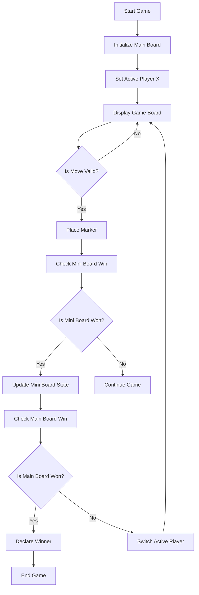
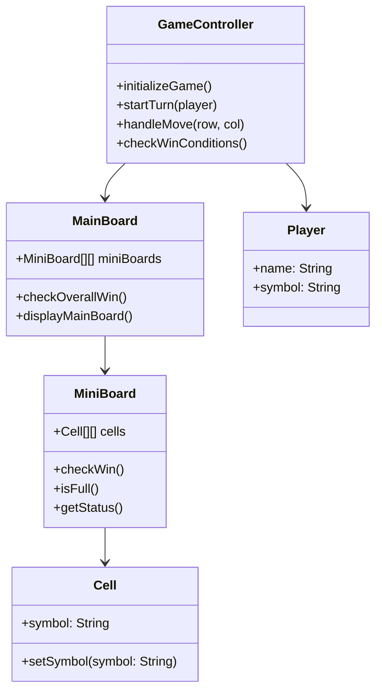

# Ultimate Tic Tac Troll Game Plan

## 1. Game Components

### Main Components

- Main Board: A 3x3 grid of individual boards, representing the larger game area.
- Individual Board (Mini Board): Each cell of the main board is a 3x3 Tic Tac Toe grid.
- Cells: Smallest unit of gameplay, contained within each mini board.
- Players: Two players, Player X and Player O, taking alternate turns.
- Current Board Pointer: Indicates which mini board the next move should be played on.
- Game Status Indicator: Tracks whether the game is ongoing, tied, or if a player has won.

### State Management

- Global State: Stores the overall status of the game and the main board.
- Mini Board State: Manages the state of each mini board (won, drawn, or active).
- Turn Tracker: Keeps track of whose turn it is.
- Winner Tracker: Checks for a winner on each mini board and on the main board.

## 2. Core Game Logic Flow Chart

## 3. Implementation Diagram

## 4. Overview of Game Flow

1. Game Initialization: The game initializes the main board, sets each mini board, and begins with Player X.
2. Gameplay: Players take turns placing their symbols (X or O) in the active mini board. The location of the next mini board is determined by the cell chosen.
3. Win Condition: A player wins a mini board by getting three in a row (horizontally, vertically, or diagonally). The main board is won similarly if a player secures three mini boards in a row.
4. Game End: The game continues until the main board has a winner or all mini boards are full and no more moves can be made, resulting in a draw.

## 5. Additional Notes

- Edge Case Handling: If a chosen cell sends the move to an already completed mini board, the next player is allowed to choose any available mini board.
- State Management Framework: Use React Context or a state management library like Redux for handling the complex game state in NextTS.
